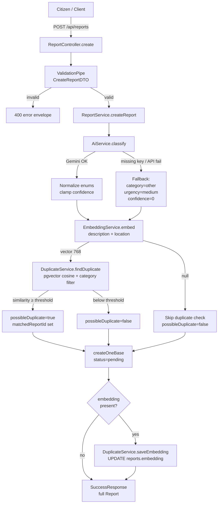

# CrisisDesk AI — Project Architecture

Backend-only NestJS API for citizen emergency / public-service triage: free-text
reports (Bangla or English) are classified by **Google Gemini**, embedded for
**pgvector** duplicate detection, and managed via public + JWT-protected admin
routes.

Related docs: [API.md](./API.md) (endpoint reference) · [README.md](../README.md)
(setup & ops).

---

## 1. Tech stack

| Layer         | Choice                                                       |
| ------------- | ------------------------------------------------------------ |
| Runtime       | Node.js 22 (`/.nvmrc`)                                       |
| Framework     | NestJS 11 (Express) + TypeScript                             |
| ORM / DB      | TypeORM + PostgreSQL 17 + **pgvector**                       |
| AI            | Gemini `generateContent` (triage) + `embedContent` (768-dim) |
| Cache / queue | Valkey (`iovalkey`, Redis-compatible)                        |
| Auth          | Custom global JWT `AuthGuard` + `JWTHelper` (HS512)          |
| Validation    | `class-validator` / `class-transformer`                      |
| Docs          | Swagger UI at `/docs`                                        |
| Security      | Helmet, CORS, `@nestjs/throttler`                            |
| Tests         | Jest                                                         |
| Deploy        | Docker multi-stage + Compose; CI on push to `main`           |

---

## 2. Repository layout

```
crisis-desk-ai/
├── src/
│   ├── main.ts                 # Bootstrap (pipes, prefix, security, Swagger)
│   ├── env.ts                  # Typed ENV from environments/<NODE_ENV>.env
│   ├── swagger.ts              # OpenAPI at /docs (+ optional /docs/app)
│   ├── security.ts             # Helmet, CORS, body limits
│   ├── logger.ts               # Winston (non-dev)
│   ├── app/
│   │   ├── app.module.ts       # Root module + global guards/filters/interceptors
│   │   ├── base/               # BaseEntity, BaseService, BaseFilterDTO
│   │   ├── decorators/         # @Public(), validators, …
│   │   ├── filters/            # ExceptionFilter (error envelope)
│   │   ├── guards/             # CustomThrottlerGuard
│   │   ├── helpers/            # BcryptHelper, JWTHelper (@Global)
│   │   ├── interceptors/       # ResponseInterceptor, ClsUserInterceptor
│   │   ├── middlewares/        # RequestLoggerMiddleware
│   │   ├── modules/
│   │   │   ├── report/         # Core domain (triage + duplicates)
│   │   │   ├── auth/           # Login / refresh / change-password
│   │   │   ├── user/           # Users (INTERNAL / USER)
│   │   │   ├── system/         # Health, version, rate-limit check
│   │   │   └── @cache/         # Valkey cache module
│   │   ├── pipes/
│   │   └── types/              # SuccessResponse, ErrorResponse, …
│   ├── database/               # TypeORM config, migrations, seeds, decorators
│   └── shared/                 # Constants, convert/dborm/common utils
├── environments/               # *.env (only example.env is committed)
├── docs/                       # This file + API.md
├── Dockerfile / entrypoint.sh
├── docker-compose.yml
└── docker-compose.template.yml # CI / production template
```

Path alias: `@src/*` → `src/*`.

---

## 3. Request lifecycle

```
HTTP request
  → RequestLoggerMiddleware
  → CustomThrottlerGuard (global)
  → AuthGuard (global; skips @Public() or SKIP_AUTH=true)
  → ValidationPipe (whitelist, forbidNonWhitelisted)
  → Controller → Service(s)
  → ResponseInterceptor → SuccessResponse envelope
  → on error: ExceptionFilter → { success, statusCode, message, errorMessages }
```

**Success envelope** (`SuccessResponse`):

```json
{
  "success": true,
  "statusCode": 200,
  "message": "...",
  "data": {},
  "meta": { "total": 0, "page": 1, "limit": 10, "skip": 0 }
}
```

`meta` appears on paginated lists. The JSON `statusCode` is always `200` for
success; Nest may still emit HTTP `201` for `@Post()` handlers.

---

## 4. Configuration

`src/env.ts` loads `environments/${NODE_ENV || 'development'}.env` via dotenv and
exports a typed `ENV` object (api, security, jwt, db, valkey, auth, gemini,
duplicate, seedData).

| Group      | Key variables                                                              |
| ---------- | -------------------------------------------------------------------------- |
| App        | `PORT`, `API_PREFIX` (`api`), `APP_NAME`                                   |
| Gemini     | `GEMINI_API_KEY`, `GEMINI_MODEL`, `GEMINI_EMBED_MODEL`, `GEMINI_EMBED_DIM` |
| Duplicates | `DUPLICATE_SIMILARITY_THRESHOLD` (default `0.85`)                          |
| Auth       | `JWT_*`, `SKIP_AUTH`, `SUPER_ADMIN_EMAIL` / `SUPER_ADMIN_PASSWORD`         |
| DB         | `DB_*` (Postgres)                                                          |
| Valkey     | `QUEUE_*`, `CACHE_STORE_*`, `CACHE_TTL`                                    |

Copy `environments/example.env` → `development.env` (or `production.env`) for
local/deploy use. Those files are gitignored except `example.env`.

---

## 5. Module catalog

| Module             | Path                      | Role                                                                             |
| ------------------ | ------------------------- | -------------------------------------------------------------------------------- |
| **ReportModule**   | `src/app/modules/report/` | Submit / list / get / stats; admin status + delete; AI + embeddings + duplicates |
| **AuthModule**     | `src/app/modules/auth/`   | `POST /auth/login` (INTERNAL only), refresh, change-password                     |
| **UserModule**     | `src/app/modules/user/`   | User CRUD; password hashing subscriber                                           |
| **SystemModule**   | `src/app/modules/system/` | Public health / version / throttler probe                                        |
| **CacheModule**    | `src/app/modules/@cache/` | Global Valkey cache helpers                                                      |
| **HelpersModule**  | `src/app/helpers/`        | Global `BcryptHelper`, `JWTHelper`, `HttpModule`                                 |
| **DatabaseModule** | `src/database/`           | TypeORM root connection                                                          |

`AppModule` also registers CLS (`nestjs-cls`), throttling, and the global
guard / filter / interceptor providers listed above.

---

## 6. Report domain (core)

### Layout

```
report/
├── report.module.ts
├── controllers/report.controller.ts
├── entities/report.entity.ts
├── enums/index.ts
├── dtos/          # create, filter, update-status
├── interfaces/    # AI result shape
└── services/
    ├── report.service.ts      # Orchestration + CRUD + stats
    ├── ai.service.ts          # Gemini triage
    ├── embedding.service.ts   # Gemini embeddings
    └── duplicate.service.ts   # pgvector nearest neighbour
```

### HTTP API (`API_PREFIX` → `/api`)

| Method   | Path                         | Auth   | Purpose                           |
| -------- | ---------------------------- | ------ | --------------------------------- |
| `POST`   | `/api/reports`               | Public | Submit + AI + duplicate detection |
| `GET`    | `/api/reports`               | Public | List (filters + pagination)       |
| `GET`    | `/api/reports/stats/summary` | Public | Analytics (declared before `:id`) |
| `GET`    | `/api/reports/:id`           | Public | Single report                     |
| `PATCH`  | `/api/reports/:id/status`    | JWT    | Update status                     |
| `DELETE` | `/api/reports/:id`           | JWT    | Hard-delete report                |

Admin write routes omit `@Public()`, so the global `AuthGuard` requires a Bearer
access token. Tokens are issued by `POST /api/auth/login`, which only accepts
**INTERNAL** users (seeded superadmin).

### Entity (`reports`)

Extends `BaseEntity` (UUID `id`, soft-delete columns, audit JSONB). Domain
fields: `name`, `contact`, `location`, `description`, `language`, `category`,
`urgency`, `summary`, `suggestedAction`, `confidence`, `possibleDuplicate`,
`matchedReportId`, `status`.

`embedding` is `vector(768)` in Postgres, marked `@IgnoredColumn()` on the
entity so TypeORM migrations do not manage it; `DuplicateService` reads/writes
it with raw SQL. An HNSW cosine index is created in the schema migration.

**Enums**

- `category`: `medical`, `fire`, `accident`, `crime`, `flood`, `utility`,
  `public_service`, `infrastructure`, `other`
- `urgency`: `low`, `medium`, `high`, `critical`
- `status`: `pending`, `in_review`, `assigned`, `resolved`, `rejected`
- `language`: `bn`, `en`, `unknown`

Search fields (`SEARCH_TERMS`): `description`, `location`, `summary`, `name`.

### Submission pipeline



Step summary:

1. Validate body (`location` + `description` required).
2. `AiService` → Gemini structured JSON (`category`, `urgency`, `summary`,
   `suggestedAction`, `confidence`); enum-validated with safe fallback.
3. `EmbeddingService` → 768-dim Gemini embedding of description + location.
4. `DuplicateService` → pgvector nearest neighbour (same category); flag when
   similarity ≥ `DUPLICATE_SIMILARITY_THRESHOLD`.
5. Persist report (`status=pending`), then store embedding via raw SQL when
   present.

If `GEMINI_API_KEY` is missing or Gemini fails, classification falls back to
`category=other`, `urgency=medium`, `confidence=0`, and submission still
succeeds. A null embedding skips duplicate detection.

---

## 7. Authentication & authorization

| Piece                             | Behavior                                                         |
| --------------------------------- | ---------------------------------------------------------------- |
| Global `AuthGuard`                | JWT via `JWTHelper`; skipped for `@Public()` or `SKIP_AUTH=true` |
| `POST /api/auth/login`            | Public; restricted to `userType === internal`                    |
| `POST /api/auth/refresh-token`    | Public; re-issues tokens                                         |
| `PATCH /api/auth/change-password` | JWT required                                                     |
| Report admin routes               | Any valid JWT (no `@Roles` / userType check on the route itself) |

In practice only INTERNAL users can log in through `/auth/login`, so admin
tokens come from the seeded superadmin (`yarn db:seed`).

---

## 8. Database & migrations

| Concern         | Detail                                                                 |
| --------------- | ---------------------------------------------------------------------- |
| Config          | `synchronize: false`; entities + migrations under `src/database/`      |
| CLI             | `yarn migration:run` / `revert` / `generate` / `create`                |
| Seed            | `yarn db:seed` (runs compiled `dist/database/seeds/seed.js`)           |
| pgvector        | Extension + `reports.embedding vector(768)` + HNSW index in migration  |
| Ignored columns | `@IgnoredColumn()` + generate script strips DROP/ADD for those columns |

Local Compose publishes Postgres on host `5433` and Valkey on `6380`
(defaults) so they do not clash with system installs.

---

## 9. Caching

`CacheModule` (`@cache`) provides Valkey-backed cache infrastructure. Queue and
cache settings both point at the same Valkey instance in local Compose
(`localhost:6380` from the host; service name `valkey` inside Compose).

---

## 10. Docker & deployment

**Local full stack:** `docker compose up --build` — `db` (pgvector/pg17) +
`valkey` + `app`. Compose overrides `DB_HOST` / Valkey hosts to internal service
names. Env file: `environments/${NODE_ENV:-development}.env`.

**Host API + Docker infra:** `docker compose up db valkey -d` then `yarn dev`.

**Image:** multi-stage `Dockerfile` (Node 22 Alpine). `entrypoint.sh` runs
migrations → seed → `node dist/main.js`.

**CI:** push to `main` → `.github/workflows/deploy.yml` builds/pushes the image,
writes production env from secrets, renders `docker-compose.template.yml`, and
starts the stack on the server.

---

## 11. Testing & scripts

| Script               | Purpose                                                |
| -------------------- | ------------------------------------------------------ |
| `yarn dev`           | Nest watch mode                                        |
| `yarn build`         | Compile to `dist/`                                     |
| `yarn test`          | Unit/integration specs (Gemini mocked in report tests) |
| `yarn migration:run` | Apply migrations                                       |
| `yarn db:seed`       | Seed INTERNAL superadmin                               |

Report coverage focuses on AI normalization/fallback, duplicate thresholding,
stats, the create pipeline, and the controller layer.

---

## 12. Design notes (current codebase)

- No separate `AdminGuard` or `AUTH_ENABLED` flag — admin = missing `@Public()`
  - global JWT guard; login is INTERNAL-only.
- Event/email/PDF helper modules from the boilerplate scaffold are **not** part
  of this app (removed); helpers are bcrypt + JWT only.
- Swagger remains available at `/docs` in all environments (production disable is
  not active).
- Interactive API contract: [API.md](./API.md) and Swagger UI.
