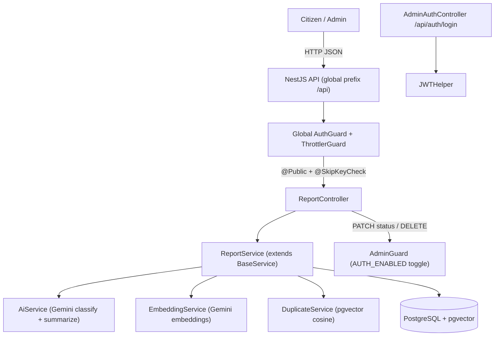

# CrisisDesk AI — Project Plan

**Overview:** Build the CrisisDesk AI triage backend as a new Reports module on
top of the existing NestJS boilerplate: Gemini-powered classification/
summarization, pgvector embedding-based duplicate detection, full CRUD +
analytics endpoints at `/api/reports`, toggleable admin auth, Swagger docs,
tests, and Docker/deploy setup covering every bonus.

> Note: This plan is the original build plan. A few implementation details were
> refined afterwards (e.g. embedding model is `gemini-embedding-001`, chat model
> `gemini-flash-latest`, Postgres image `pgvector/pgvector:pg17`, HNSW index).
> See `README.md` and `docs/API.md` for the current source of truth.

## Delivery checklist

- [x] **env-config** — Add gemini/auth/admin/duplicate config to `src/env.ts` and `environments/example.env` + `development.env`; set `API_PREFIX=api`.
- [x] **enums-entity** — Create report enums and `Report` entity (AutoEntity, BaseEntity, statics) following `typeorm-entities` conventions.
- [x] **pgvector-migration** — Hand-write migration: `CREATE EXTENSION vector`, reports table, `embedding vector(768)` column, index.
- [x] **dtos** — Create create-report, update-status, and filter DTOs (extends `BaseFilterDTO`) with class-validator + `@ApiProperty`.
- [x] **ai-service** — Implement `AiService` with Gemini structured JSON classification/summarization, enum validation, bn/en handling, fallback.
- [x] **embedding-service** — Implement `EmbeddingService` using Gemini embeddings (768 dims).
- [x] **duplicate-service** — Implement `DuplicateService` with raw pgvector cosine nearest-neighbor query + threshold.
- [x] **report-service** — Implement `ReportService` (extends `BaseService`) orchestrating create flow, filters, and stats/summary analytics.
- [x] **admin-auth** — Implement `AdminGuard` (`AUTH_ENABLED` toggle) + `/api/auth/login` issuing JWT via `JWTHelper`; seed admin.
- [x] **controller** — Implement `ReportController` at `/api/reports` with `@Public`/`@SkipKeyCheck`, correct route ordering, Swagger annotations.
- [x] **guard-fix** — Adjust global `AuthGuard` so root-level `@Public` + `@SkipKeyCheck` routes are reachable (incl. production).
- [x] **module-wire** — Create `ReportModule` and register it in `app.module.ts`.
- [x] **docker** — Update docker-compose (pgvector Postgres + Redis) and Dockerfile for reliable deploy.
- [x] **tests** — Add Jest unit tests (duplicate, AI parsing, stats) and e2e endpoint tests with mocked Gemini.
- [x] **docs** — Write README + `docs/API.md`: setup, env, migrations, Docker, deployment, and full endpoint/API reference.
- [x] **verify** — Run build, lint, tests; manually exercise all endpoints incl. duplicate case.

## CrisisDesk AI — Intelligent Triage Backend

### Architecture

### Reports submission flow

1. Validate body with class-validator DTO.
2. `AiService` calls Gemini (structured JSON `responseSchema`) -> `category`, `urgency`, `summary`, `suggestedAction`, `confidence` (validated against allowed enums; clamped/fallback on bad output). Handles bn/en/unknown input.
3. `EmbeddingService` creates a Gemini embedding of `description` (+ location/category context).
4. `DuplicateService` runs a pgvector nearest-neighbor query pre-filtered by category to set `possibleDuplicate` + `matchedReportId`.
5. Persist via `createOneBase`; return the full report (AI fields + duplicate info) wrapped by the existing `ResponseInterceptor`.

### Endpoints (exact spec paths, global prefix `api`)

- `POST /api/reports` - public: submit + AI + duplicate detection.
- `GET /api/reports` - public: filters `category`, `urgency`, `status`, `search`, date range + pagination (via `BaseFilterDTO`).
- `GET /api/reports/:id` - public.
- `PATCH /api/reports/:id/status` - admin-gated: validate status enum.
- `DELETE /api/reports/:id` - admin-gated.
- `GET /api/reports/stats/summary` - public: analytics (declared BEFORE `:id` route to avoid param capture).
- `POST /api/auth/login` - public: returns admin JWT (demonstrates auth bonus).

### Files to create (mirror `user`/`gallery` module conventions)

- `src/app/modules/report/entities/report.entity.ts` - `@AutoEntity`, extends `BaseEntity`; statics `tableName='reports'`, `apiRouteName='reports'`, `SEARCH_TERMS=['description','location','summary']`; columns for name, contact, location, description, language, category, urgency, summary, suggestedAction, confidence, possibleDuplicate, matchedReportId, status. `embedding` is added via manual migration (not a TypeORM-decorated column, see below).
- `src/app/modules/report/enums/index.ts` - `ReportCategory`, `ReportUrgency`, `ReportStatus`, `ReportLanguage`.
- `src/app/modules/report/dtos/` - `create-report.dto.ts`, `update-status.dto.ts`, `filter-report.dto.ts` (extends `BaseFilterDTO`), all with `@ApiProperty`.
- `src/app/modules/report/services/report.service.ts` - extends `BaseService<Report>`; orchestrates AI + embedding + duplicate + `getStatsSummary()` (uses query builder for category/urgency/status breakdowns).
- `src/app/modules/report/services/ai.service.ts` - Gemini classification/summarization (SDK `@google/generative-ai` or REST via existing `axios`).
- `src/app/modules/report/services/embedding.service.ts` - Gemini embeddings (768 dims).
- `src/app/modules/report/services/duplicate.service.ts` - raw pgvector query (`embedding <=> $1`) + threshold.
- `src/app/modules/report/controllers/report.controller.ts` - `@Controller(Report.apiRouteName)` at root of `/api`; `@Public()` + `@SkipKeyCheck()`; Swagger decorators.
- `src/app/modules/report/guards/admin.guard.ts` - if `AUTH_ENABLED` false -> allow; else verify JWT via `JWTHelper`.
- `src/app/modules/report/controllers/adminAuth.controller.ts` + small login service - `/api/auth/login` issuing JWT for seeded admin.
- `src/app/modules/report/report.module.ts` - `TypeOrmModule.forFeature([Report])`, providers, controllers; import `HelpersModule` for `JWTHelper`.
- `src/database/migrations/<ts>-AddReportsAndPgvector.ts` - hand-written: `CREATE EXTENSION IF NOT EXISTS vector`, reports table (or generated table + this for extension), `embedding vector(768)` column, index. (pgvector is the one explicit case for a manual migration.)

### Files to edit

- `src/app/app.module.ts` - add `ReportModule` to `MODULES`.
- `src/env.ts` - add `gemini` (apiKey, model, embedModel, embedDim), `auth.enabled`, `admin` (email/password or reuse `seedData.superAdmin`), `duplicate.threshold`.
- `environments/example.env` (+ local `development.env`) - `API_PREFIX=api`, `GEMINI_API_KEY`, `GEMINI_MODEL`, `GEMINI_EMBED_MODEL`, `AUTH_ENABLED=false`, `ADMIN_EMAIL/PASSWORD`, `DUPLICATE_SIMILARITY_THRESHOLD`, Postgres + Redis/Valkey vars.
- `src/app/modules/auth/guards/local-auth.guard.ts` - verify/allow root-level `@Public()` + `@SkipKeyCheck()` routes (no `internal/app` prefix) so `/api/reports` is reachable in production too.
- `package.json` - add `@google/generative-ai` (or use axios).
- `docker-compose.template.yml` + `Dockerfile` - Postgres image with pgvector, Redis/Valkey service, app service, Gemini env passthrough.
- `README.md` + new `docs/API.md` - comprehensive setup, env, run, migrate, Docker, deploy, and full endpoint reference with sample requests/responses and error formats.

### AI integration details (Gemini)

- Classification model: configurable via `GEMINI_MODEL` (must support JSON schema output).
- Force JSON via `responseMimeType: application/json` + `responseSchema`; post-validate enums, clamp `confidence` to [0,1].
- Bangla+English: prompt instructs detection + English summary regardless of input language (covers multilingual bonus).
- Resilience: on Gemini failure, log + persist report with safe fallbacks (`category=other`, `urgency=medium`, `confidence=0`) so submission still succeeds; structured error path available.

### Duplicate detection (pgvector)

- Store 768-dim embedding per report.
- Query: nearest neighbor filtered by `category`, `ORDER BY embedding <=> $1 LIMIT 1`; if `1 - distance >= DUPLICATE_SIMILARITY_THRESHOLD` (default ~0.85) -> `possibleDuplicate=true`, set `matchedReportId`.
- Vector index for speed (cosine ops).

### Error handling & responses

- Reuse global `ExceptionFilter` (structured `{success:false, statusCode, message, errorMessages}`) and `ResponseInterceptor` (`{success, statusCode, message, data, meta}`); superset of spec examples.
- Custom validation messages (e.g. "Description and location are required."), 404 "Report not found.", 502 "AI classification failed." where applicable.

### Bonus coverage checklist

- Bangla/English support - Gemini prompt + `language` enum.
- Admin auth - toggleable JWT + `/api/auth/login` + `AdminGuard`.
- Rate limiting - existing global `ThrottlerGuard` (optionally stricter `@Throttle` on POST).
- Schema validation - class-validator DTOs (existing global `ValidationPipe`).
- Swagger/OpenAPI - existing `swagger.ts` at `/docs`; full `@ApiProperty`/`@ApiOperation` annotations.
- Docker - updated compose (pgvector + redis) + Dockerfile.
- Tests - Jest unit tests (duplicate threshold logic, AI parsing with mocked Gemini, stats) + e2e for endpoints (auth off, Gemini mocked).
- Clean structure - follows module conventions.
- Deployment - Railway/Render steps (managed Postgres with pgvector + Redis); mandatory live demo.
- Advanced duplicate detection - pgvector cosine similarity.

### Deployment

- Recommend Railway or Render: provision Postgres (enable `vector` extension) + Redis, set env vars, run `migration:run`, `db:seed` admin, deploy. Document in README.

### Verification

- `yarn build` + `yarn lint:check` clean.
- Manual curl/Swagger run of all 7 endpoints incl. a duplicate submission.
- `yarn test` green.
